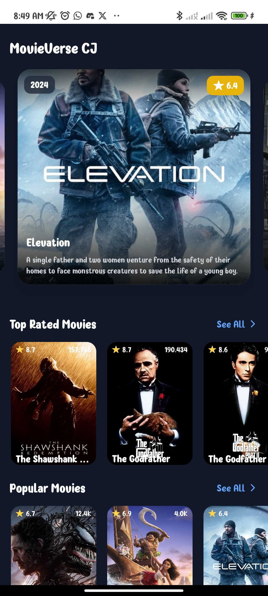
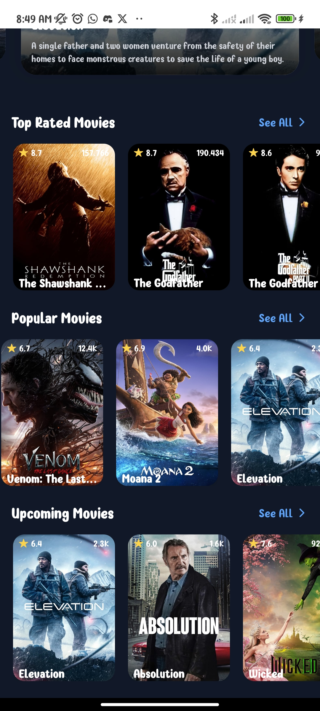
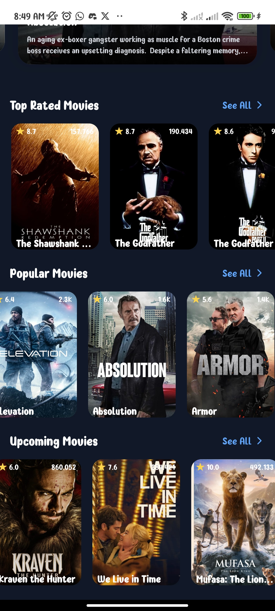
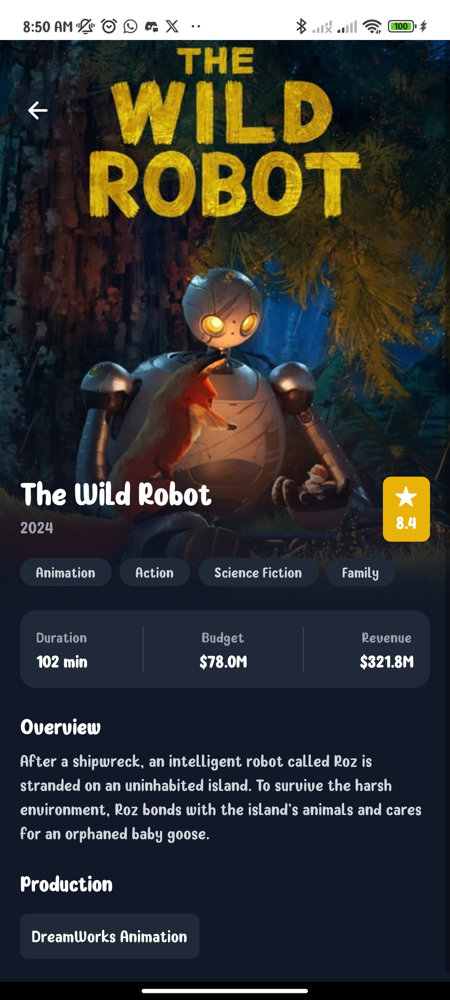

# MovieVerse CJ App


## 🌟 About the Project

**MovieVerse CJ** is a mobile application built with **React Native**, allowing users to:
- Explore a wide range of movies.
- View detailed information about movies, including release dates, ratings, and summaries.
<!-- - Watch trailers directly within the app. -->
- Discover the latest and most popular films.

The app uses the **TMDb API** to fetch high-quality movie data and trailers, ensuring users always have up-to-date information.

---

## 📱 Screenshots

<!-- {width=300}
{width=300}
{width=300}
{width=300} -->
<!--  -->

<div style="display: flex; justify-content: space-around;">
    
    
    
    
</div>

---

## 🚀 Features

- **Browse Movies:** Search and explore a wide variety of films.
- **Detailed Info:** Access movie overviews, release dates, ratings, and genres.
<!-- - **Trailers:** Watch trailers without leaving the app. -->
- **Favorites:** Save movies to your favorites (future feature).

---

## 🛠️ Technologies Used

- **React Native**: For building the cross-platform app.
- **TMDb API**: To fetch movie data and trailers.
- **Expo**: For easier development and testing.
- **React Navigation**: For seamless navigation within the app.
- **Axios**: For API calls.
- **Tanstack**: For query API calls.

---

## 📂 Folder Structure

```
moviepedia-app/
├── src/
│   ├── Domain/             # Entities, interfaces. 
│   ├── Presentation/       # Reusable UI components, App screens (Home, Details, etc.)
│   ├── Infrastructure/     # API services, repositories (TMDb integration), Navigation configuration 
│   └── assets/             # Images, icons, etc.
├── App.js                  # Root of the application
└── package.json            # Project metadata and dependencies
```

---

## ⚙️ Setup Instructions

1. Clone the repository:
   ```bash
   git clone https://github.com/yourusername/movieverse-carlos.git
   cd movieverse-carlos
   ```

2. Install dependencies:
   ```bash
   npm install
   ```

3. Add your TMDb API key:
   - Create an account on [TMDb](https://www.themoviedb.org/).
   - Obtain an API key from your TMDb account.
   - Create a `.env` file in the root of the project and add:
     ```env
     EXPO_PUBLIC_MOVIE_DB_URL=your url
     EXPO_PUBLIC_MOVIE_DB_KEY=your_api_key_here
     ```

4. Start the app:
   ```bash
   npx expo start
   ```

---

## 🤝 Contributing

Contributions are welcome! Follow these steps to contribute:

1. Fork the repository.
2. Create a new branch for your feature:
   ```bash
   git checkout -b feature/your-feature-name
   ```
3. Commit your changes:
   ```bash
   git commit -m "Add your feature description here"
   ```
4. Push to your branch:
   ```bash
   git push origin feature/your-feature-name
   ```
5. Open a pull request.

---

<!-- ## 📄 License

This project is licensed under the MIT License. See the [LICENSE](LICENSE) file for details. -->

<!-- --- -->

## 📧 Contact

Developed by **Carlos (CJ)**  
Feel free to reach out via:
- **GitHub:** [carlosJCVC](https://github.com/carlosJCVC)
- **Email:** carlosveizaga.jcvc@gmail.com

---

## 🌟 Acknowledgments

- **TMDb:** For providing an amazing movie database API.
- **React Native Community:** For extensive resources and support.
